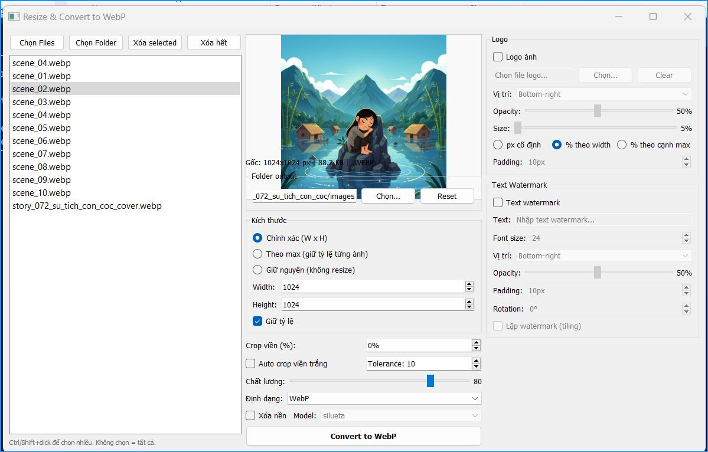

# Resize WebP Tool v2.0

Tool chuyển đổi và xử lý ảnh hàng loạt với tính năng đính logo + watermark.



## Tính năng

### Xử lý ảnh cơ bản
- **Resize ảnh**: Chính xác theo kích thước, hoặc theo cạnh lớn nhất, hoặc giữ nguyên
- **Chuyển đổi format**: WebP, JPEG, PNG
- **Crop ảnh**: Cắt viền theo % trước khi resize
- **Xóa nền**: Tích hợp rembg với 2 model (u2net, silueta)
- **Điều chỉnh chất lượng**: 1-100%

### Logo & Watermark
- **Logo ảnh**:
  - 3 chế độ kích thước: px cố định, % theo width, % theo cạnh max
  - 9 vị trí đặt logo
  - Điều chỉnh opacity, padding

- **Text watermark**:
  - Điều chỉnh font size, opacity, padding
  - 9 vị trí đặt text
  - **Rotation**: Xoay text 0-360°
  - **Tiling**: Lặp text watermark trên toàn bộ ảnh

- **Preview realtime**: Xem trước logo + watermark trước khi xử lý

### UI/UX
- Giao diện 3 cột: Danh sách file | Preview + Controls | Logo + Watermark
- Preview tự động scale theo kích thước cửa sổ
- Xóa file đã chọn khỏi danh sách
- Lưu cấu hình tự động

## Yêu cầu hệ thống

- **Python**: 3.8 trở lên
- **Hệ điều hành**: Windows, macOS, Linux
- **RAM**: Tối thiểu 2GB (khuyến nghị 4GB+ cho xử lý ảnh lớn)

## Cài đặt nhanh

> Yêu cầu: [Python 3.8+](https://www.python.org/downloads/) đã cài sẵn.

```bash
pip install resize-image-webp
resize-webp
```

### Cài từ source

```bash
git clone https://github.com/tnguyenbk/resize-image-webp.git
cd resize-image-webp
pip install .
resize-webp
```

### Bật tính năng xóa nền (tùy chọn)

```bash
# CPU only (nhẹ, phù hợp đa số máy)
pip install "resize-image-webp[cpu]"

# Hoặc GPU (nhanh hơn, cần NVIDIA GPU + CUDA)
pip install "resize-image-webp[gpu]"
```

## Hướng dẫn sử dụng

### 1. Thêm ảnh
- Click **"Thêm ảnh"** để chọn file
- Hoặc **"Thêm folder"** để chọn toàn bộ thư mục
- Click **"Xóa selected"** để xóa file đã chọn
- Click **"Clear"** để xóa toàn bộ danh sách

### 2. Chọn folder output
- Bỏ tick **"Cùng folder input"** nếu muốn chọn folder output khác
- Click **"Chọn..."** để chọn thư mục đích

### 3. Cài đặt kích thước
- **Chính xác**: Resize đúng kích thước width x height
- **Max cạnh lớn nhất**: Giữ tỷ lệ, resize sao cho cạnh lớn nhất = giá trị max
- **Giữ nguyên**: Không resize, chỉ chuyển đổi format hoặc đính watermark

### 4. Cài đặt logo (tùy chọn)
1. Tick **"Logo ảnh"**
2. Click **"Chọn..."** để chọn file logo (PNG có nền trong suốt)
3. Chọn chế độ size:
   - **px cố định**: Kích thước logo cố định (10-500px)
   - **% theo width**: Logo = % của chiều rộng ảnh (5-80%)
   - **% theo cạnh max**: Logo = % của cạnh lớn nhất (5-80%)
4. Điều chỉnh vị trí, opacity, padding

### 5. Cài đặt text watermark (tùy chọn)
1. Tick **"Text watermark"**
2. Nhập text vào ô **"Text:"**
3. Điều chỉnh font size, vị trí, opacity, padding
4. **Rotation**: Xoay text (0-360°)
   - 0° = ngang
   - 45° = chéo (phổ biến chống trộm ảnh)
   - 90° = dọc
5. **Tiling**: Tick để lặp text trên toàn bộ ảnh (bỏ qua vị trí)

### 6. Preview
- Click vào ảnh trong danh sách để xem preview
- Preview hiển thị logo + watermark realtime
- Kéo thay đổi kích thước cửa sổ → preview tự động scale

### 7. Chuyển đổi
Click **"Convert"** để bắt đầu xử lý hàng loạt

## Format hỗ trợ

**Input**: JPG, JPEG, PNG, WebP, BMP, TIFF, GIF
**Output**: WebP, JPEG, PNG

## Cấu hình

Cấu hình được lưu tự động tại `resize-webp-config.json`

## Troubleshooting

### Lỗi "rembg không khả dụng"
- Chạy: `pip install rembg[cpu]` hoặc `pip install rembg[gpu]`
- Khởi động lại ứng dụng

### Preview không hiển thị
- Kiểm tra file ảnh có hợp lệ không
- Thử chọn ảnh khác trong danh sách

### Text watermark bị cắt
- Tăng padding (ô "Padding" trong Text Watermark section)
- Font size lớn cần padding lớn hơn

### Logo quá to/nhỏ
- Đổi chế độ size (px / % theo width / % theo cạnh max)
- Điều chỉnh slider tương ứng

## License

MIT License - Tự do sử dụng cho mục đích cá nhân và thương mại.

## Version History

### v2.0 (2026-02-11)
- Thêm tính năng đính logo + watermark hoàn chỉnh
- UI 3 cột mới
- Logo: 3 chế độ size (px, % width, % max edge)
- Text watermark: Rotation + Tiling
- Preview realtime cho watermark
- Export format selector (WebP/JPEG/PNG)
- Chế độ "Giữ nguyên" không resize
- Xóa file đã chọn

### v1.0 (2025)
- Resize và chuyển đổi ảnh cơ bản
- Crop, xóa nền, điều chỉnh chất lượng
